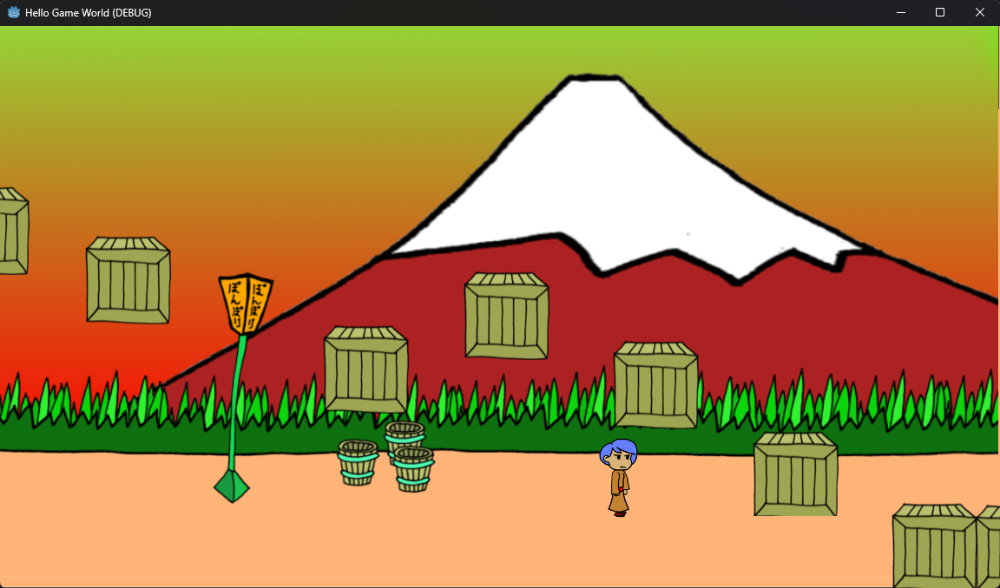

# Hello Game World 

Este é o meu primeiro projeto de jogo, desenvolvido utilizando a engine **Godot**. O objetivo principal foi entender os conceitos básicos de movimentação e física dentro da ferramenta.

## Sobre o Jogo
O projeto consiste em um cenário simples onde:
* Você controla um personagem utilizando as **setas do teclado**.
* O cenário contém caixas com física aplicada, permitindo que o personagem pule e interaja entre elas.

---

## Como Baixar e Jogar

Para executar o jogo no seu computador, siga os passos abaixo:

1. Faça o download do arquivo `hello-game-world.rar` presente neste repositório.
2. Extraia o conteúdo do arquivo `.rar` em uma pasta de sua preferência.
3. Abra a pasta extraída e execute o aplicativo **`Hello Game World.exe`**.

---

## 🛠️ Tecnologias Utilizadas
* [Godot Engine](https://godotengine.org/)

---
*Desenvolvido por VithorSantos.*